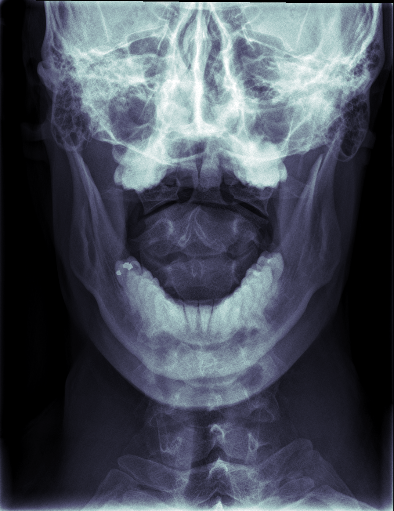
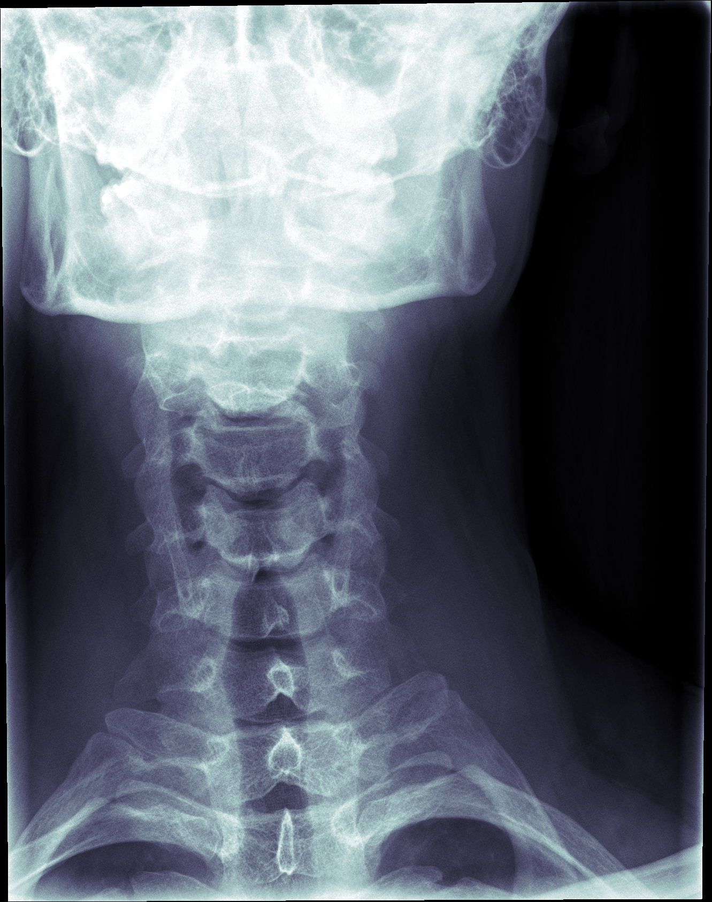
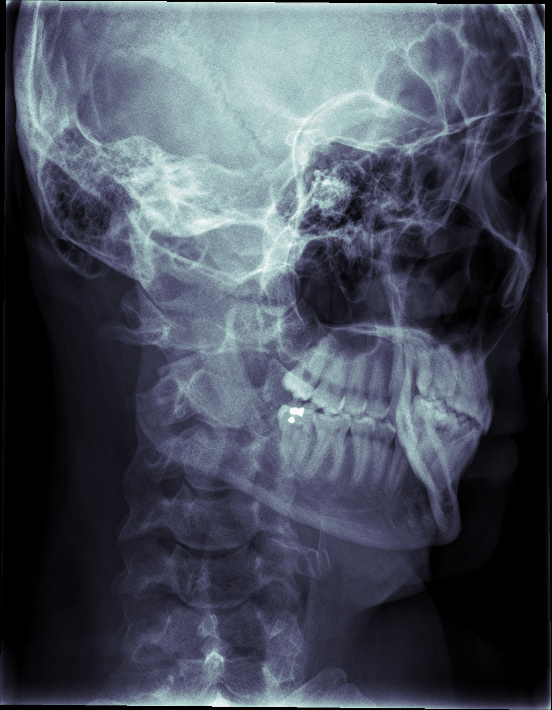

# DICON to PNG conversion

[Someone flew over a median and hit me](https://www.youtube.com/watch?v=302QaUchRq8) December 20th 2019. After we'd towed the car and talked to the police and made all the requisite calls, my mother insisted I go to the ER to be checked out for slight neck/upper back pain. They took some xrays showing nothing broken. My 12 day old car was worse for wear, but at least it saved me from injuries. I asked whether I could have the images, since it's a rare opportunity to see inside myself, and the tech told me yes, but I'd have to call later, and due to HIPAA I'd have to come in person, show ID, and sign a release.

When I showed up at the hospital a few days later, they handed me a CD. The only computer capable of reading a CD at the house was a really old Mac, and I was dismayed to find the CD full of clutter meant to support a specialized `.exe` Sectra viewer program, while containing nothing resembling familiar image or document formats. I could at least put the files on a USB drive, but I didn't have a Windows machine of my own to run the `.exe`, so I waited a while before considering the jumble again.

Eventually I stumbled across mention of `DICOM` files as a medical imaging standard, and there was a directory called `DICOM` containing several layers of folders with what could have been image files at the bottom. I tried uploading these files to file conversion websites, but these worked slowly, and some of the images appeared to be too large to handle. Some searching led me to discover that someone wrote a Python library for handling this file format, and conversion is very simple. Then [the code](convert.py) took all of a few minutes. I release it for the world here because this took me longer to figure out than it should have.

For this one the tech had me open my mouth so he could see the front of some of my upper vertebrae through the aperture between my teeth.

It's also extra freaky, like something out of Alien.

I like how my skull glows in this one, and how the vertebrae look when my neck is extended like that.

The suture across my right skull really stands out.

I wonder where the bones in my midface are. Is the sinus cavity really that big? Is my maxilla just really out of focus?

The xray tech told me to slouch for this one: "the complete opposite of what your mother always told you"

You can see my hyoid really clearly, as well as the filling in my right, lower, rearmost molar, and the bony bridge of my nose, and a bit of my hair, and my spinal cord, and those huge fins on the back of the neck vertebrae. You can see how my upper rear molars are tipped and hadn't dropped all the way. I've since gotten braces and worn rubber bands to readjust them. At the time I wasn't even aware that was abnormal.
